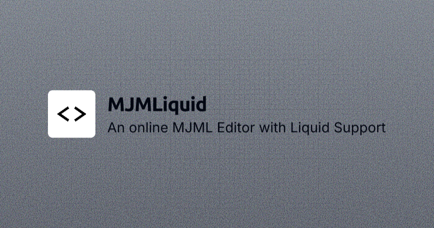
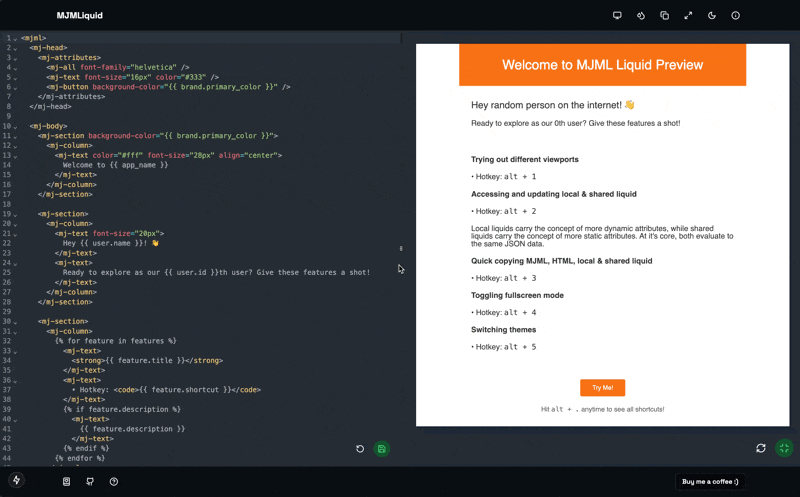

# MJML + Liquid Preview



A web-based tool for previewing MJML email templates with Liquid templating support. This was inspired by the amazing [@zonghangoh](https://github.com/zonghangoh) for productivity when developing with MJML and Liquid at [Ascenda](https://www.ascenda.com/). I thought it might be useful to others, so I beautified it, added more features to aid developing with it and open-sourced it. If you find this helpful, do give it a star!



# Local Installation

1. Clone the repository

```bash
  git clone https://github.com/lohkokwee/mjml-liquid-preview.git
  cd mjml-liquid-preview
```

2. Install dependencies

```bash
  npm i
```

3. Start the development server

```bash
  npm run dev
```

4. Open [http://localhost:3000](http://localhost:3000) with your browser view the app locally

# Features

## MJML Editor
- Write your MJML code in the left panel
- See live preview updates in the right panel
- Toggle auto-save to persist your changes locally
- Keyboard first navigation for developers (hit `option`/`alt` key to start)

## Liquid Variables
* Click the Liquid button (💧) in the header
* Choose between Local or Shared variables
  * These simply allows you to maintain different sets of variables - aids development
* Enter your Liquid variables in JSON format
* Use these variables in your MJML template

## Preview Options
* Use the viewport selector to preview different screen sizes
* Toggle between scale and overflow modes in the preview panel
* Switch between light and dark themes
* Custom viewport sizes available for precise testing

# Buy me a coffee!
Loving this? Consider buying me a coffee! Your support _(and coffee)_ lights up my world! 💖

[](https://www.buymeacoffee.com/kokwee)
